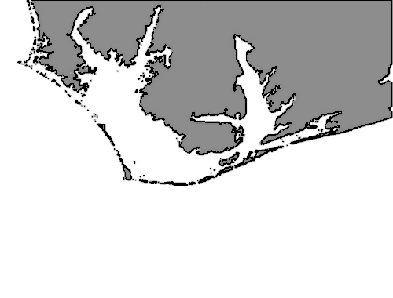

# Python Search and Rescue Simulator

## Overview
This repository contains a Python-based simulator for search and rescue operations using Bayesian search theory and OpenCV. The simulation helps in understanding how probabilistic models can aid in optimizing search strategies in complex environments.

## Features
- Implementation of Bayesian search theory to calculate probabilities for search areas.
- Visualization of search areas and operations using OpenCV.
- Simulation of lost person's movement and calculation of search effectiveness.

## Getting Started
Clone this repository to your local machine using:

Ensure you have Python and the required packages installed:

Run the simulation with:

## Simulation Map
Below is the map used for the search and rescue simulation (`cape_python.png`):

## How It Works
The simulator divides the search area into segments, assigning probabilities to each based on Bayesian updating principles. The effectiveness of a search in a given area updates the probability distribution for the next search phase.

## Contributing
Contributions to improve the simulator are welcome. Please fork the repository and submit a pull request with your changes.

